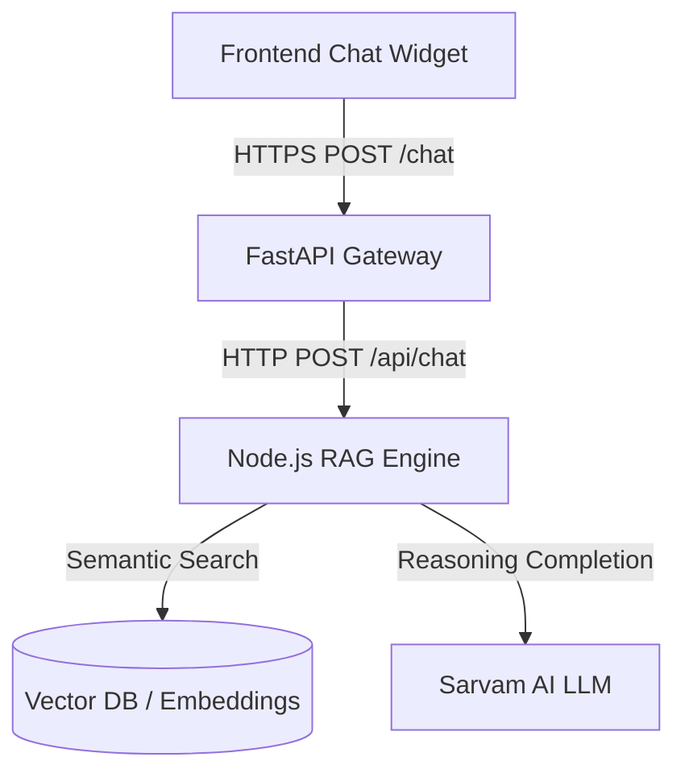

# Mintzy AI Chatbot 🤖

An intelligent, context-aware AI chatbot and embeddable widget built specifically for the **Mintzy** financial intelligence and quantitative trading ecosystem.

The system uses a Retrieval-Augmented Generation (RAG) architecture powered by semantic vector search, topic routing, conversational session memory, and **Sarvam AI**'s reasoning LLM (`sarvam-105b`).

---

## 🏗️ Architecture Overview

The system consists of three distinct layers:



1. **Frontend Widget (`mintzy-chat-frontend`)**:
   - Lightweight, responsive embeddable chat bubble.
   - Supports Markdown parsing (bullet points, code blocks, links, bold text).
   - Splash greeting screen and real-time typing indicators.

2. **Session Gateway (`backend`)**:
   - FastAPI service managing user sessions, multi-turn memory (last 5 conversation turns), and automated TTL cleanup.
   - Provides CORS handling and an uptime monitor endpoint (`/health`).

3. **RAG & Inference Engine (`mintzy-ai-chatbot`)**:
   - Express.js application responsible for knowledge retrieval.
   - Embeddings powered locally by HuggingFace Transformers (`Xenova/all-MiniLM-L6-v2`) and cosine similarity.
   - Dynamic query routing for product topics (Plugin, Seed, Backtester, SDK, Pricing tiers).
   - Pronoun and follow-up query resolution.
   - Powered by Sarvam AI (`sarvam-105b`) for accurate and warm, conversational responses.

---

## 📁 Repository Structure

```text
mintzy-chatbot/
├── backend/                     # FastAPI Session & API Gateway
│   ├── main.py                  # Session store, /chat, /health, CORS
│   └── requirements.txt         # FastAPI, uvicorn, httpx, pydantic
├── mintzy-ai-chatbot/           # RAG Core & LLM Integration
│   ├── data/                    # Knowledge base text docs & embeddings.json
│   ├── src/
│   │   ├── llm/
│   │   │   └── sarvam.js        # Sarvam AI client & system prompts
│   │   ├── retriever/
│   │   │   └── search.js        # HuggingFace vector embedding & search
│   │   ├── routes/
│   │   │   └── chat.js          # Retrieval router, pronouns, fallbacks
│   │   └── server.js            # Express server entry point
│   ├── package.json
│   └── requirements.txt
├── mintzy-chat-frontend/        # Client-Side Embeddable Widget
│   ├── demo.html                # Local demo testing page
│   ├── index.html               # Production demo page
│   ├── widget.css               # Widget styles & Tailwind resets
│   └── widget.js                # Chatbot UI logic & markdown renderer
└── deployment_guide.md          # Production deployment instructions
```

---

## 🚀 Getting Started

### Prerequisites

- **Node.js**: `v18.0.0` or higher
- **Python**: `3.9` or higher
- **Sarvam AI API Key**: Sign up at [Sarvam AI](https://sarvam.ai) to get an API key.

---

### 1. Set Up the Node.js RAG Engine (`mintzy-ai-chatbot`)

```bash
cd mintzy-ai-chatbot
npm install
```

Create a `.env` file in `mintzy-ai-chatbot/`:

```env
PORT=5000
SARVAM_API_KEY=your_sarvam_api_key_here
```

Start the service:

```bash
# Development (auto-reload)
npm run dev

# Production
npm start
```

*The RAG service will run on `http://localhost:5000`.*

---

### 2. Set Up the FastAPI Gateway (`backend`)

In a new terminal window:

```bash
cd backend
python -m venv venv

# Windows
venv\Scripts\activate

# macOS / Linux
source venv/bin/activate

pip install -r requirements.txt
```

Create a `.env` file in `backend/` (optional, defaults to local):

```env
NODE_BACKEND_URL=http://localhost:5000/api/chat
ALLOWED_ORIGINS=*
SESSION_TTL_SECONDS=1800
```

Start the FastAPI gateway:

```bash
uvicorn main:app --reload --port 8000
```

*The gateway will run on `http://localhost:8000` (API Docs available at `http://localhost:8000/docs`).*

---

### 3. Run the Frontend Chat Widget (`mintzy-chat-frontend`)

Open `mintzy-chat-frontend/demo.html` in your web browser, or serve it using any local static file server:

```bash
# Example with Python:
cd mintzy-chat-frontend
python -m http.server 3000
```

Visit `http://localhost:3000/demo.html` to interact with Mynt!

---

## 🔌 Embedding the Chat Widget on Your Website

To add the chat widget to any website or web application, include the CSS and JavaScript assets before the closing `</body>` tag:

```html
<!-- Mintzy Chatbot Stylesheet -->
<link rel="stylesheet" href="https://your-domain.com/widget.css">

<!-- Configure Backend Endpoint -->
<script>
  window.CW_CONFIG = {
    apiUrl: "https://your-fastapi-backend.onrender.com"
  };
</script>

<!-- Markdown Parser & Widget Script -->
<script src="https://cdnjs.cloudflare.com/ajax/libs/marked/9.1.6/marked.min.js"></script>
<script src="https://your-domain.com/widget.js"></script>
```

---

## 📡 API Reference

### 1. `POST /chat` (FastAPI Gateway)
Sends a user message and returns the chatbot's response while tracking conversation history.

- **URL**: `/chat`
- **Method**: `POST`
- **Request Body**:
  ```json
  {
    "message": "What is the Plugin framework?",
    "session_id": "optional-uuid"
  }
  ```
- **Response**:
  ```json
  {
    "reply": "Mintzy's Plugin Framework is an end-to-end automated trading system...",
    "session_id": "abc-123-xyz"
  }
  ```

### 2. `GET /health` (FastAPI Gateway)
Health check endpoint for uptime monitors and keep-alive cron jobs.

- **Response**:
  ```json
  {
    "status": "ok"
  }
  ```

### 3. `POST /session/reset` (FastAPI Gateway)
Clears the session history for a given `session_id`.

---

## ⚙️ Configuration & Environment Variables

| Variable | Service | Default | Description |
| :--- | :--- | :--- | :--- |
| `PORT` | Node.js | `5000` | Port for the Express RAG server |
| `SARVAM_API_KEY` | Node.js | — | API key for Sarvam AI models |
| `NODE_BACKEND_URL` | FastAPI | `http://localhost:5000/api/chat` | URL to the upstream Node.js RAG server |
| `ALLOWED_ORIGINS` | FastAPI | `*` | Allowed CORS origins (set to domain in prod) |
| `SESSION_TTL_SECONDS`| FastAPI | `1800` | Session lifetime (in seconds) |

---

## 🛡️ Guardrails & Formatting Features

- **Sequential Bullet Steps**: Installation commands and multi-step tutorials are formatted with code blocks and bullet points.
- **Context Fallbacks**: Clear, helpful deflection messages when queries fall outside Mintzy's domain without unnecessary footers.
- **Pronoun Resolution**: Follow-up questions like *"what are its prices?"* or *"how do I install it?"* automatically resolve to the active product topic.
- **Tailwind Preflight Compatibility**: Custom CSS list overrides ensure bullet points render consistently regardless of host site styles.

---

## 📄 License

This project is licensed under the [ISC License](LICENSE).
