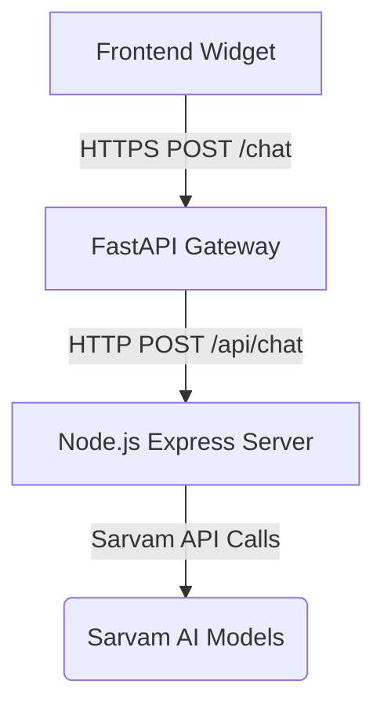

# Mintzy Chatbot Deployment Guide

This guide outlines how to deploy your complete chatbot system to production. The project consists of three main parts that need to be deployed:



---

## Part 1: Deploying the Node.js Express Server (`mintzy-ai-chatbot`)

This server handles RAG retrieval (parsing text files in the `data/` folder, matching embeddings) and coordinates the LLM response.

### Recommended Hosting Services
- **Render** (Web Services - Free tier available)
- **Railway**
- **Heroku**
- **VPS (Ubuntu, digitalocean, AWS EC2)**

### Steps to Deploy (e.g., Render / Railway)
1. **Prepare files**: Ensure `package.json` has a start script pointing to `src/server.js` (which is already configured).
2. **Git Repository**: Push the `mintzy-ai-chatbot` folder (or your entire repository) to GitHub.
3. **Create Service**: Link your GitHub repository to Render/Railway and create a new **Web Service**.
4. **Environment Variables**: Define the following variables in the hosting provider's dashboard:
   - `PORT`: `5000` (or leave it to default dynamically)
   - `SARVAM_API_KEY`: *Your actual Sarvam AI API Key*
5. **Deployment Command**:
   - Build Command: `npm install`
   - Start Command: `node src/server.js`
6. **Note the URL**: After successful deployment, your provider will give you a public URL (e.g., `https://mintzy-node-backend.onrender.com`).

---

## Part 2: Deploying the FastAPI Gateway (`backend`)

The Python gateway acts as the secure entry point, keeps session history memory, and shields the Node.js server.

### Recommended Hosting Services
- **Render** (Web Services)
- **Railway**
- **VPS**

### Steps to Deploy
1. **Requirements**: Verify that `requirements.txt` contains `fastapi`, `uvicorn`, `httpx`, and `pydantic`.
2. **Create Service**: Set up a new Python web service on your hosting provider linked to your GitHub repo.
3. **Environment Variables**: Add these settings in the provider's panel:
   - `NODE_BACKEND_URL`: `https://your-node-backend-url.onrender.com/api/chat` (replace with the URL from Part 1)
   - `ALLOWED_ORIGINS`: `*` (or restrict this to your specific website domain for security, e.g., `https://mywebsite.com`)
   - `SESSION_TTL_SECONDS`: `1800` (session timeout in seconds, default is 30 minutes)
4. **Deployment Command**:
   - Start Command: `uvicorn main:app --host 0.0.0.0 --port 8000`
5. **Note the URL**: Once deployed, you will get a public URL (e.g., `https://mintzy-fastapi.onrender.com`).

---

## Part 3: Deploying the Frontend Chat Widget (`mintzy-chat-frontend`)

Since the frontend consists of static files (`demo.html`, `widget_v4.js`, and `widget_v4.css`), it is extremely cheap and easy to host.

### Recommended Hosting Services
- **Vercel**
- **Netlify**
- **GitHub Pages**
- **Direct Integration**: You can upload these files directly to your main website hosting server.

### Steps to Deploy
1. **Configure Connection**: Open your HTML file (e.g., `demo.html` or your main page) and update the `window.CW_CONFIG` object to point to your FastAPI gateway URL:
   ```html
   <script>
     window.CW_CONFIG = { 
       apiUrl: "https://your-fastapi-backend-url.onrender.com" // URL from Part 2
     };
   </script>
   ```
2. **Deploy**: Upload `demo.html`, `widget_v4.js`, and `widget_v4.css` to your static host (e.g., Netlify).
3. **Embed on Other Pages**: If you want the chat bubble to appear on other pages of your site, add these three lines to those HTML files:
   ```html
   <link rel="stylesheet" href="https://your-static-host.com/widget_v4.css">
   <script>
     window.CW_CONFIG = { apiUrl: "https://your-fastapi-backend-url.onrender.com" };
   </script>
   <script src="https://cdnjs.cloudflare.com/ajax/libs/marked/9.1.6/marked.min.js"></script>
   <script src="https://your-static-host.com/widget_v4.js"></script>
   ```

---

## Production Best Practices

> [!WARNING]
> In production, change `ALLOWED_ORIGINS` in your FastAPI gateway configuration to list only your actual website domain instead of `*` (wildcard). This prevents malicious third-party websites from making spam requests to your chatbot backend.

> [!TIP]
> If you scale your FastAPI gateway to run multiple instances or workers, the standard in-memory session history storage will not sync between them. You should configure it to use a Redis database instance to share session memory across all instances.
